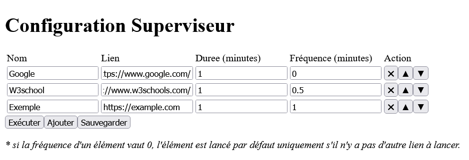

# Web Superviseur

Au travail, il y avait une télévision acrochée sur le mur, sur lequel on venait caster un onglet de Chrome pour y afficher des informations importantes. Il fallait que je fasse une application pour pouvoir saisir différent lien à afficher dans cette onglet, et les faire changer selon un temps qu'on viendrait aussi saisir.

## Technologie

J'ai utilisé VueJS pour manipuler les données et pour permettre de facilement réorganisé le tableau. 